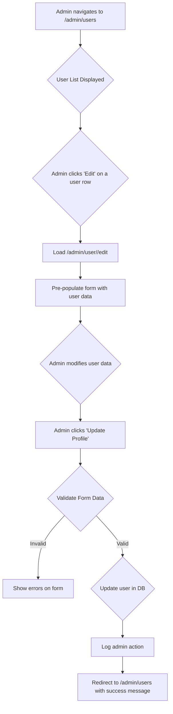

# Admin "Edit User" Screen Implementation Plan (Revised)

**Date:** 2025-07-20
**Status:** Plan revised and awaiting final approval.

## Summary of Revisions

This plan has been revised to incorporate several key improvements over the initial analysis:

1.  **Enhanced Security:** A critical check will be added to prevent an admin from accidentally revoking their own privileges.
2.  **Improved User Experience (UX):** Key fields will be made read-only to prevent accidental data modification, and password reset functionality is clarified.
3.  **Clearer Implementation Details:** The form class and field types are now explicitly defined.
4.  **Visual Workflow:** A Mermaid diagram has been added to illustrate the entire process.
5.  **Actionable Todo List:** The implementation strategy has been converted into a granular, step-by-step todo list for easier execution.

## Revised Implementation Plan

### Workflow Diagram

### Detailed Todo List

-   **Phase 1: Backend Setup**
    -   [ ] Create a new form `AdminEditUserForm` in `utils/forms.py` that inherits from `EditProfileForm`.
    -   [ ] Add admin-specific fields to `AdminEditUserForm`: `user_type` (SelectField), `is_active` (BooleanField), `credit_balance` (FloatField), and optional `password` fields.
    -   [ ] Create the `edit_user(user_id)` route in `routes/admin.py`.
    -   [ ] In the `edit_user` route, fetch the target user by `user_id`.
    -   [ ] Add logic to the `edit_user` route to prevent an admin from changing their own `user_type` or `is_active` status.
-   **Phase 2: Frontend Template**
    -   [ ] Create the `templates/admin/user_edit.html` file by copying the content from `templates/user/profile.html`.
    -   [ ] Modify the template to use the new `AdminEditUserForm`.
    -   [ ] Add the new admin-only fields to the template, placing them in a new "Admin Controls" section.
    -   [ ] Make key fields like `email` and `created_at` read-only in the template for data integrity.
    -   [ ] Change the form's `action` to point to the new `admin.edit_user` route.
    -   [ ] Update the "Back" button to link to the `admin.view_users` page.
-   **Phase 3: Integration & Final Touches**
    -   [ ] Add an "Edit" button to each row in the `templates/admin/users.html` table.
    -   [ ] Implement the POST logic in the `edit_user` route to handle form submission and update the user in the database.
    -   [ ] Add comprehensive admin action logging for all successful and failed edit attempts.
    -   [ ] Ensure flash messages provide clear feedback to the admin.

## Next Steps

Once this revised plan is approved, we can proceed with the implementation.